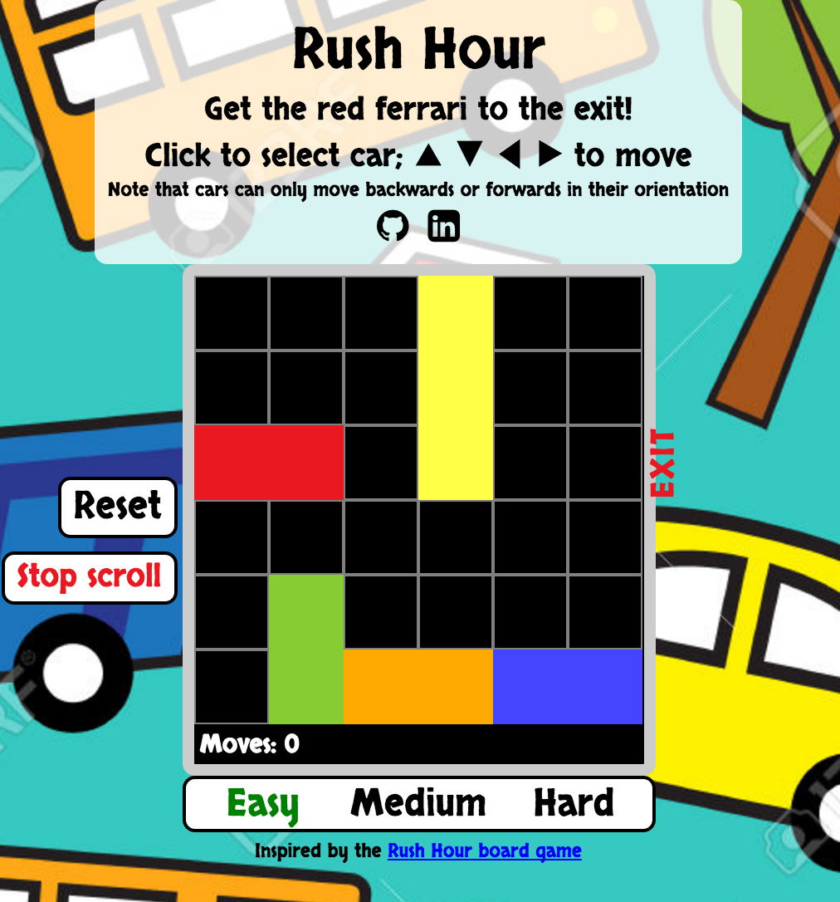
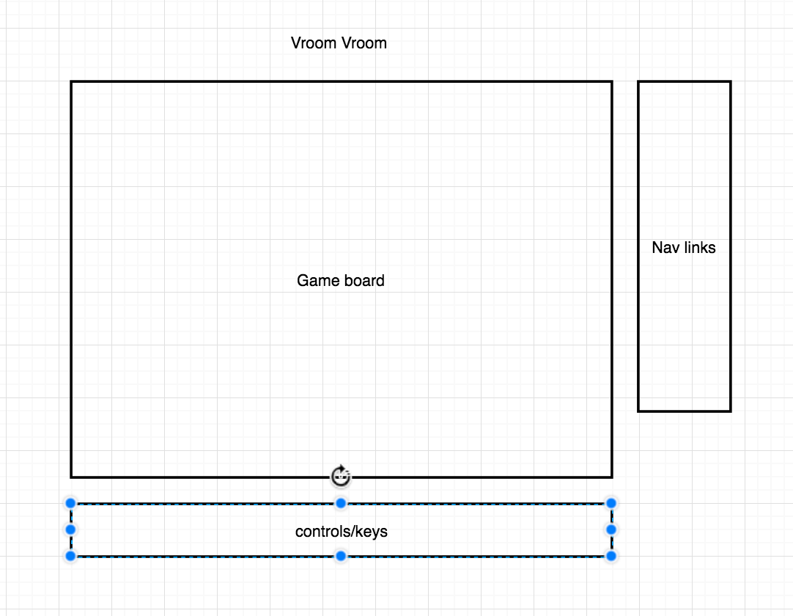

## Rush Hour

### Background

Rush Hour is a interactive browser game based on the popular board game [Rush Hour][link].
[link]: http://www.thinkfun.com/products/rush-hour/

In Rush Hour, player is presented with a puzzle with slidable blocks (cars).
The goal is move the red car to the exit by sliding the other vehicles out of the way.
Try to complete the game with as few moves as possible and with as little time as possible.

### Architecture and Technologies

This project is implemented with the following technologies:

- Vanilla JavaScript and `jquery` library for overall structure and game logic.
- HTML5 for presentation
- Webpack to bundle and serve up the various scripts.

There are four main scripts involved in this project:

- `rush_hour.js`: the entry file for Webpack. This script also installs all the listeners for resetting game and changing levels.

- `car.js`: handle the different types of cars (including length and color) as well as the "target" red car logic. The car objects `move` logic is handled in this file.

- `board.js`: this script handles the logic for creating and updating the the board and car positions. It is fed into the view file to construct the board upon class initiation.

- `view.js`: draws out the visuals of the board and the cars; contain the keydown listeners for moving cars.

### Future features

Some anticipated updates of this game are:

- [X] Count and show the number of moves
- [X] More levels and better graphics
- [ ] Adding hints in a modal on the side
- [ ] Add scoreboard scoring mechanisms
- [ ] Add time count for a user to finish a game
- [ ] Auto-generate random games

### Functionality & MVP  

In the Rush Hour game, users will be able to:

- [X] Start and reset the game board
- [X] Select car to move with mouse click
- [X] Move car blocks with the up, down, left and right keys
- [X] Advance in levels (2 total levels at least)

In addition, this project will include:

- [X] An About modal/component describing the background and rules of the game
- [X] A component holding the controls with corresponding keys and what they do
- [X] A production ReadMe

### Implementation Timeline

**Day 1**: Setup all necessary Node modules, including getting webpack up and running and map out all the methods that are necessary for the game logic.  Create `webpack.config.js` as well as `package.json`.  Write a basic entry file and the bare bones of all 3 scripts outlined above. Goals for the day:

- Get a green bundle with `webpack`
- Set up the js files and map out necessary methods

**Day 2**: First, build out the `Car` object to connect to the `Board` object.  Then, use `board.js` to create the game board. Lastly, use `view.js` to render the game. Goals for the day:

- Complete the `car.js` module (constructor, update functions)
- add listeners to all the car objects on up down left and right keys, and feed those actions as moves to the car (has logic to handle validMove?)

**Day 3**: Implement core game logic and built board for 3 (if time, 5) different levels.  Goals for the day:

- Have a functional grid on the frontend that correctly handles iterations from one generation of the game to the next

**Day 4**: Install the controls for the user to interact with the game.  Style the frontend, making it polished and professional.  Goals for the day:

- Create controls for reset and game level change
- Have a styled game, nice looking controls and title

### Wireframes

This app will consist of a single screen with game board, game controls, and nav links to the Github, my LinkedIn,
and the About modal.  Game controls will include Start and Reset buttons.

